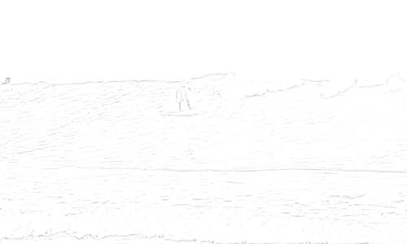

# Collection of moviepy experiments


## Videoeditor moviepy (based on python)

http://zulko.github.io/moviepy


## Run examples

To run examples using Docker

1. install docker
2. build docker image by `make build`
3. run docker image by `make run`
4. now run examples, e.g. `python src/text/concat-text.py`


## Howto

### List available fonts

```
import moviepy.editor as mpy

print(mpy.TextClip.list('font'))
```

### List background colors

```
import moviepy.editor as mpy

print(mpy.TextClip.list('color'))
```

### Preparing sample videos

Cut videos to 5 seconds, remove audio and resize to 500:300

```
ffmpeg -i input.mp4 -to 00:00:05 -an -vf scale=500:300 final.mp4
```

## Video Codec

https://zulko.github.io/moviepy/ref/VideoClip/VideoClip.html

Codec to use for image encoding. Can be any codec supported by ffmpeg. 
If the filename is has extension ‘.mp4’, ‘.ogv’, ‘.webm’, the codec will be set 
accordingly, but you can still set it if you don’t like the default. 
For other extensions, the output filename must be set accordingly.

Some examples of codecs are:

* 'libx264' (default codec for file extension .mp4) makes well-compressed videos (quality tunable using ‘bitrate’)
* 'mpeg4' (other codec for extension .mp4) can be an alternative to 'libx264', and produces higher quality videos by default
* 'rawvideo' (use file extension .avi) will produce a video of perfect quality, of possibly very huge size
* png (use file extension .avi) will produce a video of perfect quality, of smaller size than with rawvideo
* 'libvorbis' (use file extension .ogv) is a nice video format, which is completely free/ open source. However not everyone has the codecs installed by default on their machine
* 'libvpx' (use file extension .webm) is tiny a video format well indicated for web videos (with HTML5). Open source

## rule of thumb for video size

	filesize (in MB) = (bitrate in Mbit/s / 8) * (video length in seconds)

## ffmpeg options for hiqh quality encoding

* https://trac.ffmpeg.org/wiki/Encode/H.264

## Used libraries

- OpenCV
- Numpy
- Scipy
- Pillow

## Notes

- OpenCV works with numpy arrays

## Render examples

### Crossfade


### Pixelate


### Sketchy



# References

- Some sample videos are taken from https://www.pexels.com
- https://github.com/AditiRastogi250701/Image-Cartoonifier/blob/main/Image%20Cartoonifier.py
- https://www.pexels.com/video/close-up-view-of-a-lava-lamp-2000817/
- https://www.pexels.com/video/water-abstract-art-oil-drops-4156092/
- https://gist.github.com/hashABCD/58f7c94bc5b22c0bd3e1192a7690e1d1#file-img2sketch
- https://pixabay.com/videos/jellyfish-sea-dangerous-underwater-26818/
- https://pixabay.com/videos/skate-sport-water-action-exercise-110734/
